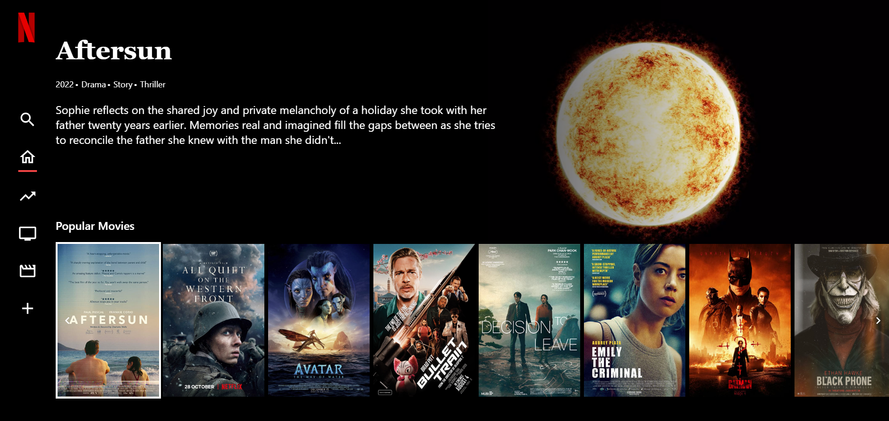

# NetflixTV-Clone
 


This project is a simple Netflix-like application developed using Vue.js and Pinia. Tailwind CSS is used within the project.

## Features

- **Home Page**: Displays a list of popular movies and TV shows.
- **Detailed Information**: View detailed information by clicking on a movie or TV show.
- **Video Player**: Watch video content directly on the platform.


## Project Setup

1. Navigate to the project folder:

    ```bash
    cd NetflixTV-Clone
    ```

2. Install dependencies:

    ```bash
    npm install
    ```

3. Start the project:

    ```bash
    npm run dev
    ```

4. Go to [http://localhost:5173](http://localhost:5173) in your browser.

## Technologies Used

- Vue.js
- Pinia
- Tailwind CSS

## Screenshots


## License

This project is licensed under the MIT License. See the `LICENSE` file for more information.